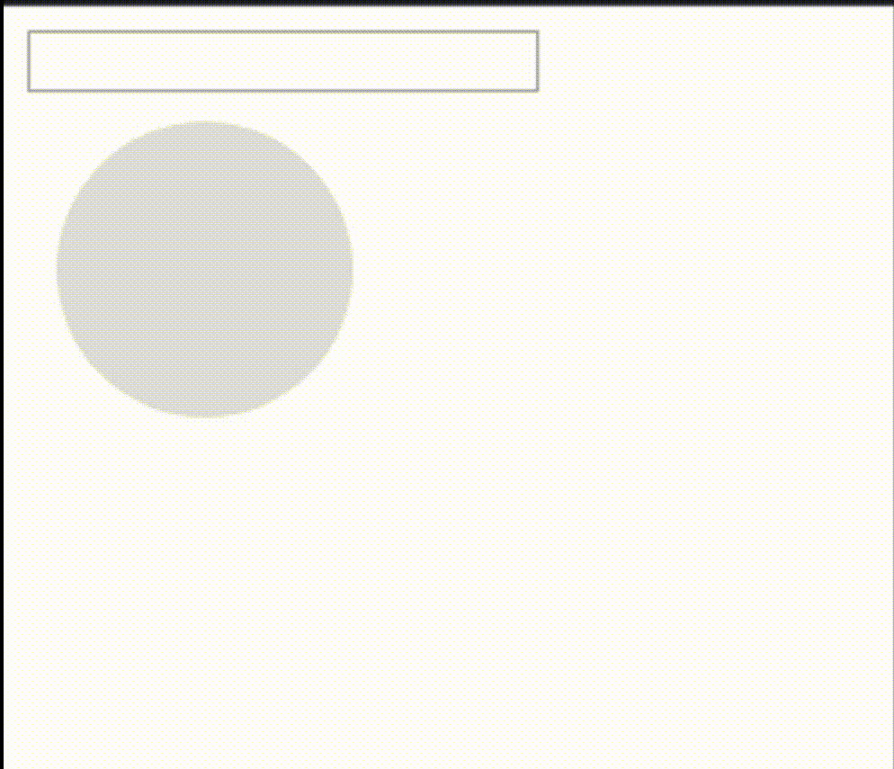

The other day I was trying to copy an element's value to the clipboard. I found out there was no straight forward way to do this with elements other than input and textarea. So how do we do it?

What we will actually do is create a hidden input element with the value of what we want to copy and remove it right after we get the value.

Let's say we have an input element that is a circle with a certain width, height and color. Now we want to copy the color that is represented in our clipboard and paste it to the input of type text.

```html
<div>
  <input type="text" />
  <input type="button" class="color" />
</div>
```

```css
.color {
  display: block;
  width: 100px;
  height: 100px;
  border-radius: 50%;
  margin: 10px;
  cursor: pointer;
  border: none;

  &:focus {
    outline: 0;
  }
}
```

We create a click eventListener and grab our inputs background color with <span class="highlight-in-text"> getComputedStyle</span>. And pass it to our <span class="highlight-in-text">copyToClipboard</span> function.

Now in the <span class="highlight-in-text">copyToClipboard</span> function we create an div element. In the div element we pass our styles and color value using template literals. We then append it to the body, focus on it and execute the copy command. After we get the value copied we remove the element.

> Note: contentEditable makes the hidden element editable like an input. And by focusing on that we are able to copy it.

```js
const color = document.querySelector(".color")

color.addEventListener("click", function() {
  const bg = getComputedStyle(this).backgroundColor
  copyToClipboard(bg)
})

function copyToClipboard(color) {
  const div = document.createElement("div")
  div.innerHTML = `<div tabindex="-1" style="position: fixed; top: 0px; left: 0px" id="clipboard" contentEditable>${color}</div>`
  document.querySelector("body").appendChild(div.firstChild)
  const clipboard = document.getElementById("clipboard")
  clipboard.focus()

  document.execCommand("SelectAll")
  document.execCommand("Copy", false, null)

  clipboard.remove()
}
```

<div style="width: 50%; margin: 0 auto;">
	
</div>

That was it. Simple?
