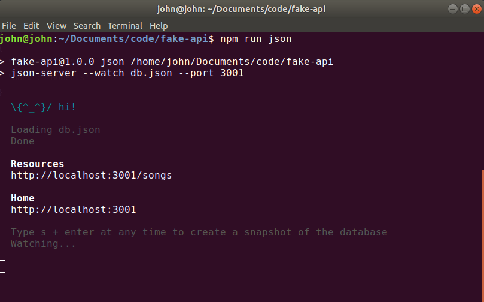
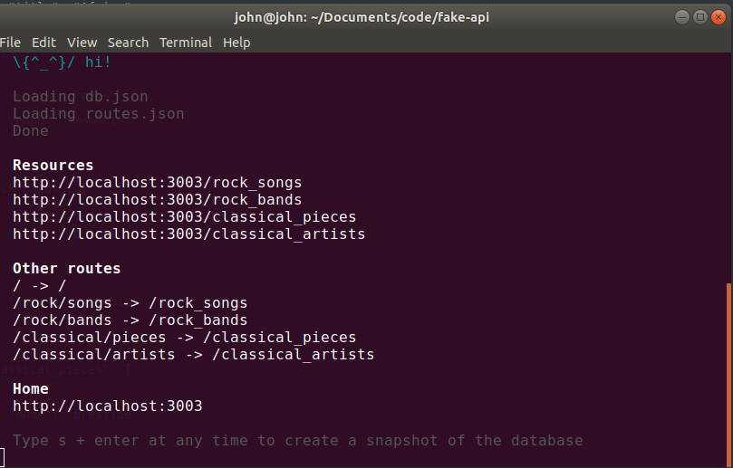

Many times as developers we want a quick back-end to fetch data from. Instead of a real API we just want to have some fake data to play with.  Whatever the reason is, a fake API comes in handy during development.

For this we are going to use a  package called json-server.  

We are going to set up a quick server and explore some cool features that ship with json-server. There are more features included like pagination and filtering but here are the one's that I found myself grabbing the most.

As always you can dig into the [documentation](https://github.com/typicode/json-server).

Here is the [source](https://github.com/john2220/fake-api).

##Basic Server

First we are going to init a <span class="highlight-in-text">package.json</span> file in our project. . .

```
mkdir fake-api
cd fake-api
npm init -y
```

> Note:  With the __-y__ flag we are going to skip the prompt process.


. . . and install json-server

```
npm install json-server
```

We are going to create a <span class="highlight-in-text">db.json</span>file where our data going to be stored just like a server.

```json
{
	"songs": [
		{
			"title": "Africa",
			"band": "Toto",
		},
		{
			"title": "Fkj",
			"band": "Moments",
		}
	]
}
```

In our <span class="highlight-in-text">package.json</span> file we are going to add the following script. 
All we are doing here is watching in our <span class="highlight-in-text">db.json</span> file for changes which is hosted in port 3001.

```json
"json": "json-server --watch db.json --port 3001" 
```

Now if we run <span class="highlight-in-text">npm run json</span> our server is running.


 

##Generate Random Data

In an index.js file we are going to generate some random users.   

```javascript
let names = ['Mary', 'John', 'Mike', 'Paul', 'Anna', 'Chris'];
let ages = [34, 56, 12, 22, 24, 54];

module.exports = () => {
	const data = { users: [] };
	for (let i = 0; i < 10; i++) {
		let randomName = names[Math.floor(Math.random() * names.length)];
		let randomAges = ages[Math.floor(Math.random() * ages.length)];
		data.users.push({ id: i, name: `${randomName}`, age: `${randomAges}` });
	}
	return data;
}
```

Our script will look like this.

```json
"db": "json-server --watch index.js --port 3002" 
```

And again by running <span class="highlight-in-text">npm run db</span> we have yet another server.


##Custom Routes

Many times when we are building our fake API we want our endpoints to mimic a real case scenario.
We might want our url's to look something like this.


```
http://localhost:3004/rock/songs
http://localhost:3004/rock/bands
http://localhost:3004/classical/pieces
http://localhost:3004/classical/artists
```

So how we do this?

Our <span class="highlight-in-text">db.json</span> will have the typical JSON format.


```json
{
	"rock_songs": [
		{
			"title": "Africa",
			"band": "Toto"
		},
		{
			"title": "Fkj",
			"band": "Moments"
		}
	],
	"rock_bands": [
		{
			"name": "prestige"
		},
		{
			"name": "columbia"
		}
	],
	"classical_pieces": [
		{
			"name": "prestige"
		},
		{
			"name": "columbia"
		}
	],
	"classical_artists": [
		{
			"name": "prestige"
		},
		{
			"name": "columbia"
		}
	]
}
```


Then we create a <span class="highlight-in-text">routes.json</span> with the following.

```json
{
	"/": "/",
	"/rock/songs": "/rock_songs",
	"/rock/bands": "/rock_bands",
	"/classical/pieces": "/classical_pieces",
	"/classical/artists": "/classical_artists"
}
```

On the left side is how we want our endpoint to look like, and in the right the corresponding array in our <span class="highlight-in-text">db.json</span> file. 

We will adjust our script . . .

```json
"custom:routes": "json-server db.json  --routes routes.json --port 3003"
```

. . .and if run <span class="highlight-in-text">npm run custom:routes</span> we get our custom endpoints.


 
